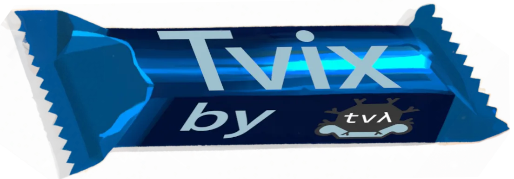

------------------

Tvix is a new implementation of Nix, a purely-functional package manager. It
aims to have a modular implementation, in which different components can be
reused or replaced based on the use-case.

Tvix is developed as a GPLv3-licensed open-source project by
[TVL][], with source code available in the [TVL monorepo][].

There are several projects within Tvix:

* `//tvix/eval` - an implementation of the Nix programming language
* `//tvix/serde` - a Rust library for using the Nix language for config files
* `//tvix/store` - an implementation of a Nix store for Tvix
* ... and a handful others!

The language evaluator can be toyed with in [Tvixbolt][], and you can check out
the [Tvix README][] ([GitHub mirror][gh]) for additional information on the
project and development workflows.

[TVL]: https://tvl.fyi
[TVL monorepo]: https://cs.tvl.fyi/depot/-/tree/tvix
[Tvixbolt]: https://tvixbolt.tvl.su
[Tvix README]: https://code.tvl.fyi/about/tvix
[gh]: https://github.com/tvlfyi/tvix/

-------------------

Check out the latest Tvix-related blog posts from TVL's website:
