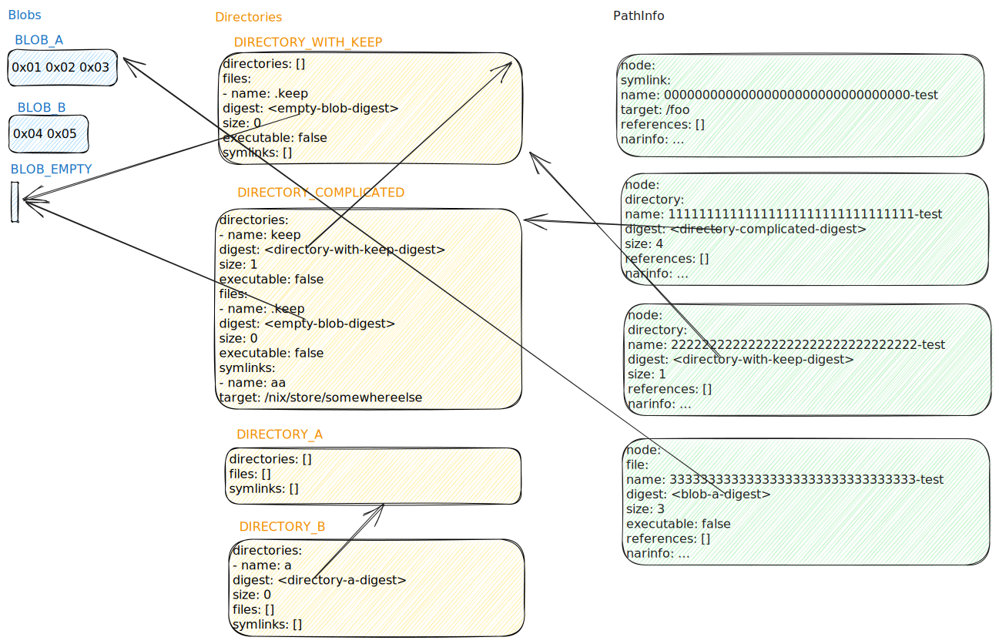

---
author:
- Florian Klink
date: 2023-09-09
title: "Tvix: Status update"
theme: moon
revealOptions:
  transition: 'fade'
---

# Tvix: Status update

2023-09-09

Florian Klink

---

## Whoami

- flokli
- nixpkgs contributor since 2018, maintaining systemd, nsncd and some
  more stuff
- Freelance Nix/DevOps consultant
- I spend too much time on computers :-)

---

## What is Tvix?

- A new implementation of Nix
- modular
- written in Rust
- developed in the [TVL](https://tvl.fyi) monorepo
- subtree exported to [github:tvlfyi/tvix](https://github.com/tvlfyi/tvix)

---

## Structure

- strong separation between **Evaluator**, **Store** and **Builder**
- Defined interfaces between different components (Protobuf/gRPC) <!-- .element: class="fragment" -->
  - Allows adding to/combining with your own components <!-- .element: class="fragment" -->
- <!-- .element: class="fragment" --> A lot of helper code for some of the Nix internals in the `nix-compat` crate

Note: Derivation types, serializers. NAR writers, nixbase32 enc/dec, Nix Hash function, stringparsing etc.

----

---

## Evaluator: Design

- <!-- .element: class="fragment" --> 
  Nix code is parsed via [rnix](https://github.com/nix-community/rnix-parser)
- <!-- .element: class="fragment" -->
  AST traversal, generate bytecode (with some transformations)
- <!-- .element: class="fragment" -->
  Bytecode is executed by an abstract machine with a Nix-specific instruction set

----

## Evaluator: Design

- <!-- .element: class="fragment" -->
  Builtins are separate from the "evaluator core"
  - <!-- .element: class="fragment" -->
    inject your own builtins
  - <!-- .element: class="fragment" -->
    this includes `builtins.derivation`!
- <!-- .element: class="fragment" -->
  IO is nicely abstracted away
  - <!-- .element: class="fragment" -->
    We can run a Nixlang subset without IO in wasm (see [tvixbolt](https://tvixbolt.tvl.su/)),
    or parse Nix into a config struct with `tvix-serde`

----

<!-- <video class="r-stretch" src="./tvixbolt.webm"></video> -->
<a href="./tvixbolt.webm">Tvixbolt Demo</a>

----

### Evaluator: Current Work

- <!-- .element: class="fragment" -->
  Current goal: **evaluate nixpkgs the same way as Nix does**
- <!-- .element: class="fragment" -->
  Checked by comparing the calculated output paths, which checks correctness of all \"parent\" output paths too.
- <!-- .element: class="fragment" -->
  Required implementing a lot of Nix internals in `nix-compat`, and `tvix-store` (A-Term, hash modulo, NAR writer/hasher)

Note: Getting output hashing correct, and exposing this in a re-usable fashion took quite some iterations to get right.

----

### Evaluator: Current Work (cont.)
- <!-- .element: class="fragment" -->
  🎉 Already correct for (and continously checked by CI on every commit):
  - <!-- .element: class="fragment" -->
  `stdenv`, `hello`
  - <!-- .element: class="fragment" -->
  `pkgsCross.aarch64-multiplatform.stdenv`, `pkgsCross.aarch64-multiplatform.hello`
- <!-- .element: class="fragment" -->
  Some work left for more complicated expressions
  - <!-- .element: class="fragment" -->
    infinite recursion [when inheriting from a `builtins.tryEval` multiple times](https://b.tvl.fyi/281)
  - <!-- .element: class="fragment" -->
    small details around file imports
- <!-- .element: class="fragment" -->
  Not too much performance finetuning until we're correct first.

----

### Evaluator: Demo

---

## Store: Design

- <!-- .element: class="fragment" -->
  Uses a very different underlying data model:
  - <!-- .element: class="fragment" -->
    Nix stores on a per- `StorePath` granularity
  - <!-- .element: class="fragment" -->
    tvix-store uses a Merkle DAG of directories, similar to git trees, but with [BLAKE3](https://github.com/BLAKE3-team/BLAKE3) digests as pointers.
  - <!-- .element: class="fragment" -->
    Compat layer in front to still render/calculate NAR on demand where needed
  - <!-- .element: class="fragment" -->
    Substitution, caching, ... possible to describe via composition/layering

----

----

### Store: Advantages

- <!-- .element: class="fragment" -->
  Less downloading of data that didn't change
- <!-- .element: class="fragment" -->
  Less duplicate data on disk/storage
- <!-- .element: class="fragment" -->
  Inherently content-addressed, so P2P substitution possible
- <!-- .element: class="fragment" -->
  Allows doing verified blob streaming ([BAO](https://github.com/oconnor663/bao), [bao-tree](https://github.com/n0-computer/bao-tree))
- <!-- .element: class="fragment" -->
  Protocol has some \"smarter\" methods to avoid roundtrips, but could all be statically pre-rendered
- <!-- .element: class="fragment" -->
  Very little data that needs to be fetched from a trusted party (or be signed)

Note: Our way of addressing blobs by their raw blake3 digest is natively compatible with iroh, the IPFS Re-implementation in Rust

----

### Store: Status

- <!-- .element: class="fragment" -->
  Whole Merkle-based store implementation (and Nix NAR compat layer) is there
  - <!-- .element: class="fragment" -->
    exercised by the output path CI tests, and a test suite.
  - <!-- .element: class="fragment" -->
    three backends (Sled, in-memory, gRPC client)
  - <!-- .element: class="fragment" -->
    more backends and more test suites planned.
- <!-- .element: class="fragment" -->
  FUSE filesystem to expose the store (to Tvix Builders, \"appliances\") <!-- .element: class="fragment" -->

Note: backends: RocksDB, sqlite, s3. fuse: lazy fetching of build input files | think about a minimal initrd to bring up network and mount the store, then run any closure.

----

### Store: Demo

----

### Store: Status (cont.)
- <!-- .element: class="fragment" -->
  More work on store composition needed (necessary for substition and caching)
- <!-- .element: class="fragment" -->
  More work on more granular blob substititon needed.
- <!-- .element: class="fragment" -->
  More work on bridges with Nix needed
  - <!-- .element: class="fragment" -->
    Get Nix to talk to a tvix-store
  - <!-- .element: class="fragment" -->
    Expose existing binary caches to tvix-store

---

### Builder: Design

- <!-- .element: class="fragment" -->
  Build requests/Build protocol is less Nix-specific
  - <!-- .element: class="fragment" -->
    allows reusing builders for other usages (non-sandboxed builds, other build systems, playing with other addressing mechanisms)
- <!-- .element: class="fragment" -->
  Distinction between a **specific build attempt** and the **general build recipe**
  - <!-- .element: class="fragment" -->
    allows keeping metadata about failed builds
  - <!-- .element: class="fragment" -->
    stats (memory/cpu consumption)
  - <!-- .element: class="fragment" -->
    comparing different produced binary outputs (r11y)

----

### Builder: Design

- <!-- .element: class="fragment" -->
  Invididual builds can be run in your desired container/virt engine/scheduler, as long as it speaks the same Build API
- <!-- .element: class="fragment" -->
  Build API composition/proxying, similar to Store composition
- <!-- .element: class="fragment" -->
  allows "unattended building" (evaluate nixpkgs locally and send all build requests to a remote builder)
- <!-- .element: class="fragment" -->
  allows tailing logs from currently/already running builds

----

### Builder: Status

- <!-- .element: class="fragment" -->
  Dummy Builder implementation in `go-nix` (using OCI)
- <!-- .element: class="fragment" -->
  Some scribble notes on the Build Protocol
- <!-- .element: class="fragment" -->
  Glue code to trigger builds from inside `builtins.derivation` needs to be written
- <!-- .element: class="fragment" -->
  Builder implementation (using `systemd-nspwan` or some container engine needs to be written.
- <!-- .element: class="fragment" -->
  Web interface to visualize store contents and build graphs/builds/logs

---

## Contributing

- <!-- .element: class="fragment" -->
  Join the IRC channel (`#tvl` on `hackint`), bridged to Matrix and XMPP
- <!-- .element: class="fragment" -->
  Check our issue tracker
- <!-- .element: class="fragment" -->
  Try to use it and tell us how you broke it!
- <!-- .element: class="fragment" -->
  Add various Nix bits to `nix-compat`

Note: or if you like what you seeing and want to sponsor parts, that's also cool :-)

---

# Thanks to...

- <!-- .element: class="fragment" -->
  all TVL contributors (some drive-by, some long-term contributors)
- <!-- .element: class="fragment" -->
  countless Nix community members for their input on the architecture and rubberducking
- <!-- .element: class="fragment" -->
  NLNET and others to sponsor parts of this

----

# Questions?

Florian Klink / <a href="https://flokli.de">flokli.de</a> 

Tvix / <a href="https://tvix.dev">tvix.dev</a> 

