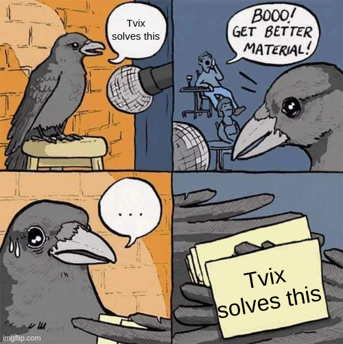

---
author:
- Florian Klink
date: 2024-10-25
title: "Tvix: Status update"
theme: solarized
revealOptions:
  transition: 'fade'
---

# Tvix: Status update

2024-10-25

Florian Klink (flokli)

---

## Whoami

- flokli<!-- .element: class="fragment" -->
- nixpkgs contributor since 2018, maintaining systemd, nsncd and more<!-- .element: class="fragment" -->
- Freelance Nix/DevOps consultant<!-- .element: class="fragment" -->

---

## What is Tvix?

---

<!-- .element: class="r-stretch" -->

---

## What is Tvix?

- A Rust re-implementation of the components of the Nix package manager<!-- .element: class="fragment" -->
- Uses different underlying approaches while retaining Nix compatibility "on the surface"<!-- .element: class="fragment" -->
- modular architecture, allowing to recombine aspects to solve your usecase<!-- .element: class="fragment" -->
- No "end-user CLI" for now, focus on getting the foundational architecture right and 100% correctness with Nix<!-- .element: class="fragment" -->

---

## Topics
- Component overview<!-- .element: class="fragment" -->
- Recent developments<!-- .element: class="fragment" -->
- Next steps<!-- .element: class="fragment" -->

Note: Component overview, to understand a bit better how it's different / updates since the last talk / outlook on roadmap

---

## Structure

  - <!-- .element: class="fragment" -->
    **tvix-castore**, the granular data storage/syncing engine.
  - <!-- .element: class="fragment" -->
    **tvix-store**, the "Nix store implementation" on top of tvix-castore
  - <!-- .element: class="fragment" -->
    **nix-compat**, a library providing access to data formats, protocols and concepts
  - <!-- .element: class="fragment" -->
    **tvix-eval**, a bytecode interpreter evaluator and core Nix *language* concepts and builtins
  - <!-- .element: class="fragment" -->
    **tvix-build**, a generic builder interface
  - <!-- .element: class="fragment" -->
    **tvix-glue**, combines tvix-eval with tvix-[ca]store and tvix-build

Note: one big cargo workspace / go into detail later! / nix-compat: concepts like output path calculation, doesn't depend on tvix crates
tvix-eval: language concepts being Scopes, Thunks, Nix values, "core builtins"

----

<!-- .element: class="r-stretch" -->

Note: Nix does do content addressing on a store path level, we're on a per-file/chunk in file. That model allows granular syncing and reuse of parts, which will  speedup substitution/copying. Because everything is ca, it'll also allow decentralization and local p2p substitution. Think about everyone in the same room serving chunks. verified streaming.

----

<!-- .element: class="r-stretch" -->

Note: track all metadata about store paths (think about the sqlite db), and link to castore instead of storing NAR. NarCalculation: this computation, is super nice to cache, as this info
never needs to expire, and is reconstructable in a pure CA manner.

----

<!-- .element: class="r-stretch" -->

Note: kept as a somewhat separate library, Tvix "first consumer". But use from your code, it doesn't depend on Tvix bits. Regularly factoring out Nix concepts into this library

----

<!-- .element: class="r-stretch" -->

Note: only includes basic builtins, like string manipulation, math, …. Other crates can bring their own builtins

----

<!-- .element: class="r-stretch" -->

Note: Not aware of Nix, store paths etc. just flexible enough to express everything in there. Use it for your own build system!

----

<!-- .element: class="r-stretch" -->

Note: connects the evaluator to store and builders

----

<!-- .element: class="r-stretch" -->

Note: Example on how to use this: Nix HTTP binary cache lens into tvix-[ca]store, allows Nix to download from and push into. It renders NARs on-the-fly

---

## Updates
Rough overview. Check blog posts and `git log` for details!

----

## Updates (#1)

 - <!-- .element: class="fragment" -->
   Fixes on error catchability and context behaviour
 - <!-- .element: class="fragment" -->
   More compact Nix Value types (memory-wise)
 - <!-- .element: class="fragment" -->
   `tvix-cli` REPL global scope manipulation (assign variables and use them in next command)
 - <!-- .element: class="fragment" -->
   `firefox.outPath` and `pkgsCross.aarch64-multiplatform.firefox.outPath` correct and added to CI 🎉

Notes: catchability/context to align behaviour with nix / … / assign variables and use them in the next REPL command

----

## Updates (#2)

 - <!-- .element: class="fragment" -->
   OpenTelemetry integration, trace propagation throughout the entire stack
 - <!-- .element: class="fragment" -->
   more backends in tvix-[ca]store (`object_store`/`local fs`/`redb`/`bigtable`/…)
 - <!-- .element: class="fragment" -->
   nar-bridge RIIR, was deployed as a fetch-through cache for cache.nixos.org at Bornhack
 - <!-- .element: class="fragment" -->
   store composition/combinators
 - <!-- .element: class="fragment" -->
   wiring up of builds (without reference propagation yet, but reference scanning)

Notes: o11y already proven super helpful for debugging where time is spent / first version of composition / builds waiting on reference propagation

----

## Other Updates

 - <!-- .element: class="fragment" -->
   A lot of the tooling for `cache.nixos.org` usage / closure analysis making use of and contributing to `nix-compat` (`@edef`) 🎉
 - <!-- .element: class="fragment" -->
   "Replit using `tvix-[ca]store` and reporting 10x storage reduction" (`@cbrewster`) 🎉
 - <!-- .element: class="fragment" -->
   "Devenv is switching to Tvix" (Talk on Saturday 12:55, `@domenkozar`) 🎉

---

## Next steps (in no specific order):

 - <!-- .element: class="fragment" -->
   Test suite classification system, to decouple test cases from test runner and share with other Nix impls
 - <!-- .element: class="fragment" -->
   (Continuous) Docs deployment, website restructuring
 - <!-- .element: class="fragment" -->
   Interactions with the evaluator (LSP, DAP)
 - <!-- .element: class="fragment" -->
   Persistent deployment of nar-bridge, as fetch-through cache for `cache.nixos.org`
 - <!-- .element: class="fragment" -->
   Blob / Chunking protocol improvements (use local chunks where possible, allow readahead)

Note: Allows filtering, reusing test cases in Nixcpp and Lix.
      Mention some behavorial changes found.
      Mention fetchTree
      Make it easier for new contributors to get started
      LSP / Debug adapter protocol / tvix-eval jobs
      / … / is gonna improve performance for IO into store paths

----

## Next steps (in no specific order) (cont.):

 - <!-- .element: class="fragment" -->
   "Build/Fetch realization goal engine" (tradeoff network bandwidth and CPU time) 
 - <!-- .element: class="fragment" -->
   More per-store metrics and instance names
 - <!-- .element: class="fragment" -->
   More backends (p2p discovery, ipfs, …)

Note: needed for builds / to get better insights into cache hit ratios etc.

---

## Contributing

- <!-- .element: class="fragment" -->
  Join the IRC channel (`#tvix-dev` on `hackint`), bridged to Matrix and XMPP
- <!-- .element: class="fragment" -->
  Check our issue tracker (b.tvl.fyi), as well as `tvix/docs/src/TODO.md` (but ask!)
- <!-- .element: class="fragment" -->
  Try to use it and tell us how you broke it!
- <!-- .element: class="fragment" -->
  Sponsoring

Note: make sure to ask in the channel to ensure noone is already working on this

---

# Thanks to...

- <!-- .element: class="fragment" -->
  all Tvix contributors
- <!-- .element: class="fragment" -->
  Nix community members for their input on the architecture
- <!-- .element: class="fragment" -->
  Sponsors

Note: some drive-by, some sticking around longer / NLNET / Clan

----

# Questions?

Florian Klink / <a href="https://flokli.de">flokli.de</a> 

Tvix / <a href="https://tvix.dev">tvix.dev</a> 

