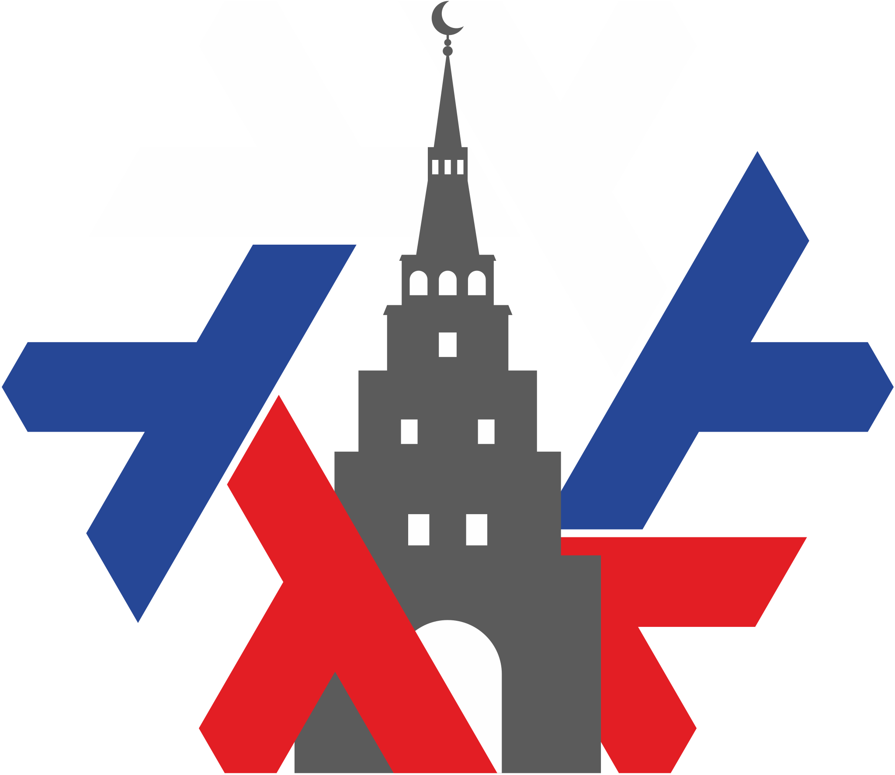
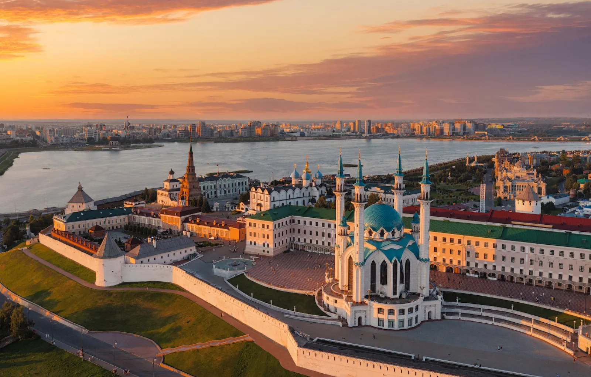
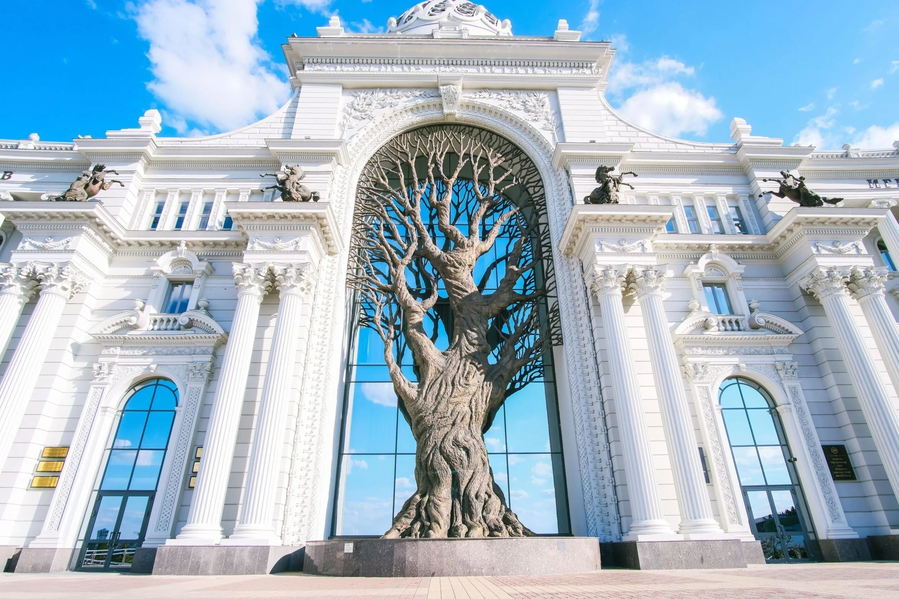
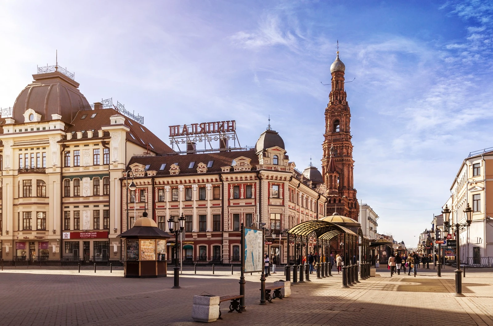

# NixOS Volga Sprint 2024

*What*

:    A week of intense hacking [on Nix](https://nixos.org/nix) in Kazan, the capital of Tatarstan in Russia.

*When*
:    22/08/2024 - 29/08/2024 (Thu - Thu)

*Where*
:    [Kazan, Tatarstan, Russia](https://yandex.com/maps/-/CDFaeW~J), on the bank of the [Volga](https://en.wikipedia.org/wiki/Volga)

*Who*
:    ~20 developers.

Volga Sprint is similar to other Nix events like [Ocean Sprint](https://oceansprint.org/) and [Thaiger Sprint](https://thaigersprint.org/).

## 📍 Location

[Kazan, Tatarstan, Russia](https://yandex.com/maps/-/CDFaeW~J)

Kazan is the historial capital of the Autonomous Republic of Tatarstan. The city is over 1000 years old and is considered one of the main tourist destinations in Russia.

Kazan is located on the bank of the Volga, the longest river in Europe, and surrounded by numerous lakes and beautiful nature.

As one of Russia's seven Muslim-majority republics, it offers a beautiful blend of Islamic architecture with traditional Russian styles.

For the sprint we will rent a large private house close to the centre of Kazan.

## 🏘️ Accommodation

Once we've determined who will attend the sprint, we'll get everyone to a shared chat room to help organise accomodation (e.g. shared apartment rentals). We'll also have some rooms available in the house that we're hosting the sprint in, but not enough for everyone.

We will choose a house that is not too far from decent hotels and rentable apartments.

Note that the sprint budget will *not* cover accommodation.

## 🍲 Food

During the sprint we'll take care of lunch in the house. For other meals, a large amount of good restaurants are available in Kazan (many of which work 24/7, which might help those who arrive with a jet-lag!).

We'll try to have a recommended dinner location on most evenings, but everyone is of course free to do their own thing!

## 🔥 Registration

[Fill out the form to apply](https://forms.yandex.ru/cloud/65e640fc73cee71ec679db66/).

We're aiming to process applications as soon as possible and notify attendees in May.

## 🧵 Topics

The topics will depend on attendees' interest, in general anything related to Nix is fine! You should have a general idea of what you're interested in working on, but ultimate it is of course up to you.

## 🛬 How to get here

Kazan has an international airport [with many connections](https://www.flightconnections.com/flights-from-kazan-kzn), including to hub airports like Istanbul (for connections to Europe), Dubai (for connections to ... everywhere) and directly flights to many Asian and Arab countries.

Depending on where you're coming from a flight via Moscow or a more eastern location like Vladivostok might be preferable. Internal Russian flights are fairly cheap, and train rides are also a comfortable alternative (although they can be up to a week long - it's a big country!).

### 🛂 Visas

Tatarstan is subject to standard Russian visa regulations. For citizens of most European[^1] (and many other) countries, a simple e-visa can be [applied for online](https://evisa.kdmid.ru/) and is valid for up to 16 days.

Citizens of many non-Western nations[^2] can travel to Russia visa-free. Please make sure to check your particular situation.

For everyone else (notably, Americans and Brits) a visa application at your local Russian embassy or visa centre is necessary. If you're approved for the sprint we're happy to help out with this!

[^1]: **e-visas** available for citizens of Andorra, Austria, Bahrain, Belgium, Bulgaria, Cambodia, China, Croatia, Cyprus, Czech Republic, Denmark, Estonia, Finland, France, Germany, Greece, Hungary, Iceland, India, Indonesia, Iran, Ireland, Italy, Japan, North Korea, Kuwait, Latvia, Liechtenstein, Lithuania, Luxembourg, Malaysia, Malta, Mexico, Monaco, Myanmar, Netherlands, North Macedonia, Norway, Oman, Philippines, Poland, Portugal, Romania, San Marino, Saudi Arabia, Serbia, Singapore, Slovakia, Slovenia, Spain, Sweden, Switzerland, Taiwan, China, Turkey, Vatican, Viet Nam

[^2]: **visa-free** travel for citizens of Abkhazia, Argentina, Armenia, Azerbaijan, Belarus, Bolivia, Bosnia and Herzegovina, Brazil, Brunei Darussalam, Chile, Colombia, Costa Rica, Cuba, Dominican Republic, Ecuador, Fiji, Guatemala, Guyana, Honduras, Israel, Kazakhstan, South Korea, Kyrgyzstan, Moldova, Mongolia, Montenegro, Nicaragua, North Macedonia, Peru, Serbia, South Africa, Tajikistan, Thailand, Turkey, Ukraine, United Arab Emirates, Uruguay, Uzbekistan, Venezuela

## 🥳 Stuff to do in Kazan

We'll organise a handful of group activities during the sprint and you can choose to attend the ones that are interesting to you! What exactly we're doing is not yet decided, but some options are things like:

* Excursion to the Kazan Kremlin, including a visit to the Kul Sharif Mosque, one of the largest mosques in Europe
* Evening sunset dinner on the bank of the Volga
- Excursion to one of the crystal clear, blue lakes near Kazan
* Evening visit to a traditional Russian *banya* (steam bath house)
* Traditional Tatar cooking class (including how to make Chak-Chak)

## 💙 Sponsors

We're looking for sponsors to cover expenses such as venue, catering, T-shirt printing and some of the activities.

Please help us make this a productive event by chipping in, so we can focus on coding instead of grocery shopping and cooking.

Our target budget is 500 000 RUB (~ 5000 EUR). Reach out to [sponsors@volgasprint.org](mailto:sponsors@volgasprint.org) or directly to tazjin.

| Level      | Contribution (RUB) | Perks                                                                                     |
|------------|--------------------|-------------------------------------------------------------------------------------------|
| Gold       | 200 000            | Silver + Large logo on the T-shirt, 2 total reserved seats, shoutout during dinner, SWAG. |
| Silver     | 150 000            | Individual + Logo on the T-shirt + 1 reserved seat.                                       |
| Individual | 50 000             | Logo on the website.                                                                      |

<!--
### 🏆 Gold

### 🏢 Silver

### 💻 Individual

-->

<!-- ## 🧑 Participants -->

## 🎖️ Organizers

* [Vincent Ambo (tazjin)](https://tazj.in), long-time Nix user, initiator of [TVL](https://tvl.fyi) & [Tvix](https://tvix.dev)
* [Mark Shevchenko](https://markshevchenko.pro/), organiser of [ProgMSK](https://prog.msk.ru/), programming polyglot and Nix user
